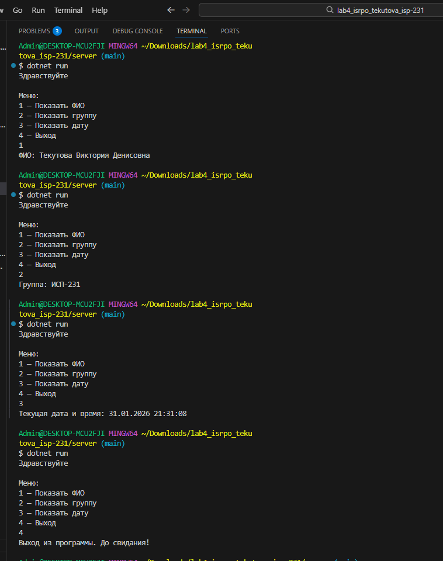

## 1. Заголовки
# Заголовок H1
## Заголовок H2
### Заголовок H3
#### Заголовок H4
##### Заголовок H5
###### Заголовок H6

---
## 2. Горизонтальные линии
***Горизонтальная линия пунктиром вверху, звездочками внизу***
***

## 3. Форматирование текста
- **Жирный текст**
- *Курсивный текст*
- ~~Зачёркнутый текст~~
- `Моноширинный текст (код)`
- ***Жирный и курсивный вместе***

---

## 4. Списки
### Маркированный список:
* Первый пункт
+ Второй пункт
- Третий пункт

### Нумерованный список:
1. Первый элемент
2. Второй элемент
3. Третий элемент

### Вложенный список:
* Основной пункт 1
  + Вложенный пункт 1.1
  * Вложенный пункт 1.2
- Основной пункт 2
  1. Вложенный нумерованный 2.1
  2. Вложенный нумерованный 2.2

---

## 5. Цитаты
> Пример цитаты.
>> Вложенная цитата второго уровня.
>>>Вложенная цитата третьего уровня.

---

## 6. Блоки кода
```csharp
// Пример кода на C#
using System;

class Program
{
    static void Main()
    {
        Console.WriteLine("Hello, World!");
    }
}
```
***
## 7. Таблица 

| № | ФИО | Группа | Присутствие |
|---|-----|--------|-------------|
| 1 | Текутова В.Д. | ИСП-231 | **+** |
| 2 | Иванов И.И. | ИСП-231 | **+** |
| 3 | Петрова А.С. | ИСП-231 | **-** |
| 4 | Сидоров В.П. | ИСП-231 | **+** |
| 5 | Кузнецова О.Л.| ИСП-231 | **+** |

### Таблица с выравниванием

| № | ФИО | Группа | Присутствие |
|:---:|:-----|:--------|:-------------:|
| 1 | Текутова В.Д. | ИСП-231 | **+** |
| 2 | Иванов И.И. | ИСП-231 | **+** |
| 3 | Петрова А.С. | ИСП-231 | **-** |
| 4 | Сидоров В.П. | ИСП-231 | **+** |
| 5 | Кузнецова О.Л.| ИСП-231 | **+** |

## 8. Картинка (Изображения)

### Скриншот главной страницы:


### Скриншот работы программы:



### Скриншот структуры проекта:


## 9. Ccылки

[Официальный сайт GitHub](https://github.com)[Главная страница проекта](../client/index.html)
---
## 10. Чекбокс
- [x] Задача выполнена
- [ ] Задача не выполнена
- [ ] Другая задача

---
## 11. Alert-блок
> [!ПРИМЕЧАНИЕ]
> Важная информация, на которую нужно обратить внимание.

> [!NOTE]
> Пример Alert-блока.
 ***

 ## 12. LaTeX формулы
 ### Inline LaTeX:
Формула: $a^2 + b^2 = c^2$
Квадратное уравнение: $ax^2+bx+c=0$
### Block LaTeX:

$$ 
\sum_{i=1}^{n} i 
= \frac{n(n+1)}{2}
$$

